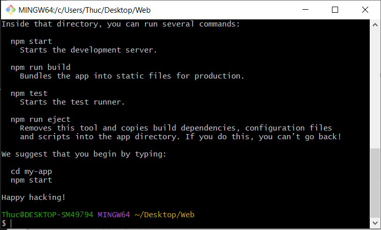

# Ghi chép lại kiến thức khi học về Web
## Các nguồn tài liệu tham khảo:
1. [Khóa học React của thầy Phạm Quang Dũng](https://programming.daotao.ai/)
2. [Javascript cơ bản](https://www.youtube.com/playlist?list=PLncHg6Kn2JT5dfQqpVtfNYvv3EBVHHVKo)
3. [React](https://www.youtube.com/playlist?list=PLncHg6Kn2JT4C0enPGQPK7ZIlEoZ1ZvRy)

## Cách cài đặt
- Mở cmd:
> npm install -g create-react-app
- Vào folder chưa project:
> create-react-app my-app

*Note: my-app là tên project, có thể thay đổi cho phù hợp*

- Đợi cài đặt xong

- Để chạy project:
> cd my-app
> npm start

Cách các mục được sắp xếp trong repo này:
- Lý thuyết sẽ đặt trong folder tài liệu. Từng mục như React, JavaScript, ... sẽ có thư mục riêng
- Bài tập sẽ có thư mục riêng, không nằm trong mục tài liệu.
- Làm lại game Tik Tac Toe