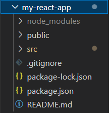
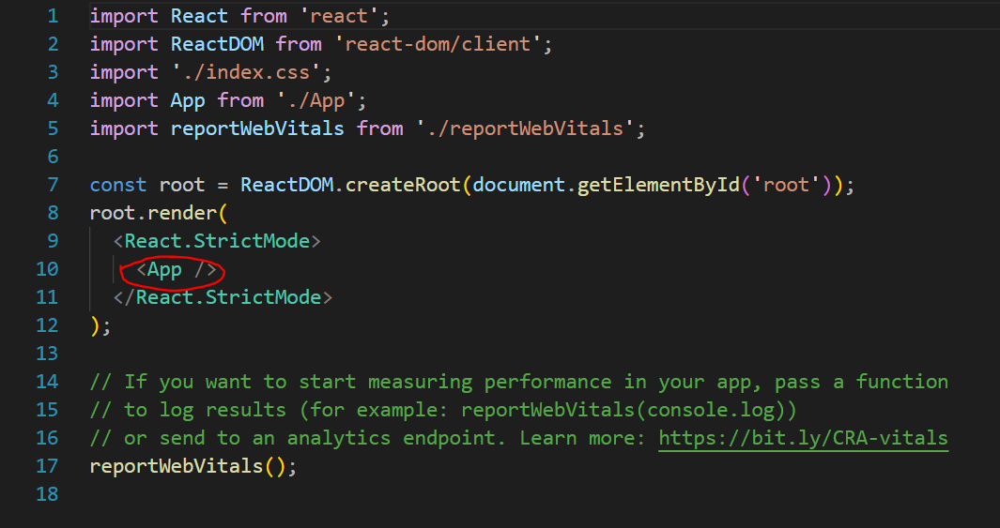
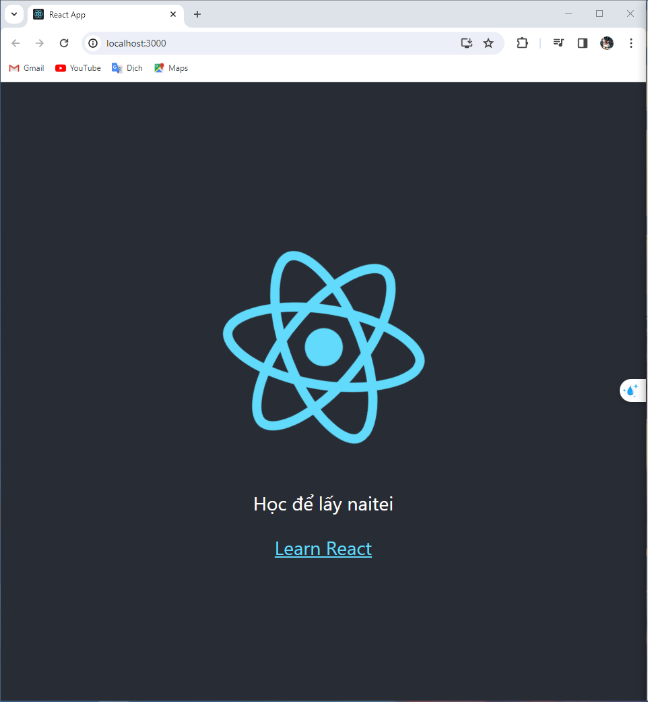

###Cấu trúc một project react:

Trong đó:
- Thư mục node_modules chưa các thư viện javascript cần thiết 
- Các components phát triển trong thư mục src
- Điểm bắt đầu là file src/index.js

- Source code trong file src/index.js:

*Bắt đầu từ component App*
Vào thư mục my-react-app, mở terminal:
> npm start

Kết quả chạy như hình

Một component thường được viết thành 1 function trả về các thẻ HTML tương ứng