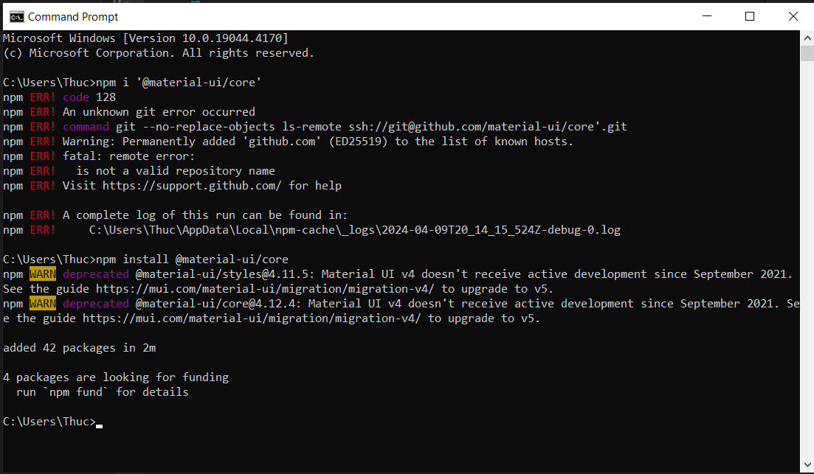
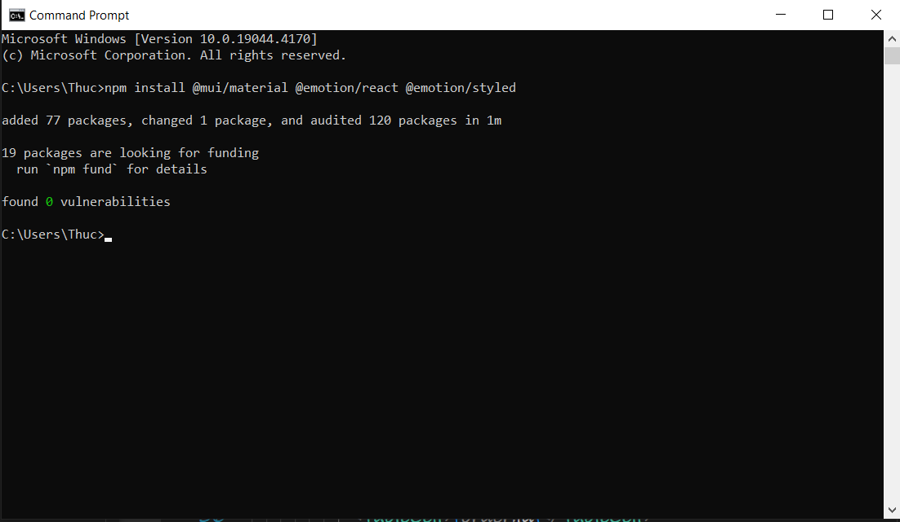

## Table
Thư viện Table của Marterial-Ui/Core
Để cài đặt thư viện, sử dụng lệnh
> npm install @material-ui/core
 

> npm install @mui/material @emotion/react @emotion/styled

Khi code thêm thư viện 
import { Table, TableHead, TableBody, TableRow, TableCell } from '@mui/material';