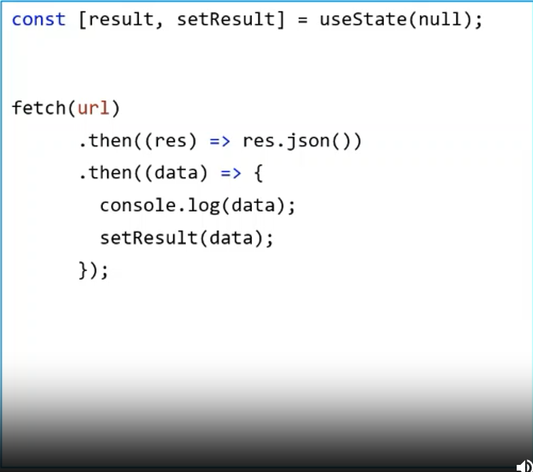
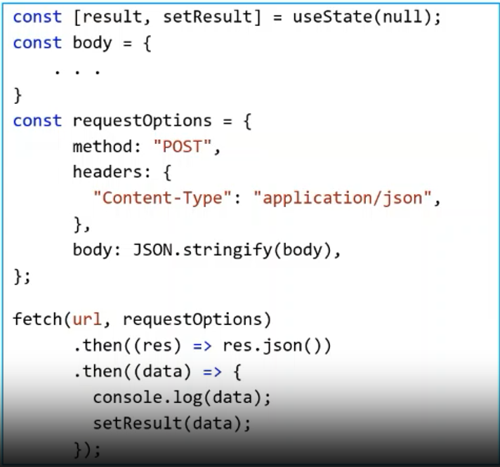

## fetch
- fetch là một hàm cho phép chúng ta gọi API từ sever
- API như một công cụ, cung cấp những hàm thực hiện chức năng tính toán trên một server ở nơi khác
- Command (2 loại phổ biến là POST và GET)
    + curl --header "Content-Type: application/json" -v POST <URL_API> -d '<STRING_JSON>' 
    + curl --header "Content-Type: application/json" -v GET <URL_API>

`
const [result, setResult] = useState(null);

fetch(url)
    .then((res) => res.json())
    .then((data) => {
        console.log(data);
        setResult(data);
    })

`

`

const [result, setResult] = useState(null);
const body = {
    ...
}
const requestOptions = {
    method: "POST",
    header: {
        "Content-Type": "application/json",
    },
    body: JSON.stringify(body),
}
fetch(url, requestOptions)
    .then((res) => res.json())
    .then((data) => {
        console.log(data);
        setResult(data);
    });

`

